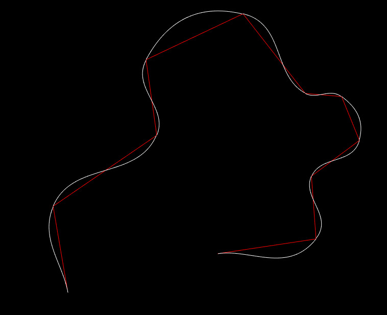

# Polynomial Line Smoothing

In this repository is a C++ & SFML implementation of my polynomial line smoothing algorithm. The basic gist is to draw function graphs of the polynomial `f(x) = ax^3 + bx^2 + cx` where `a = slope_begin + slope_end`, `b = -2.f * slope_begin - slope_end` and `c = slope_begin`.

The slopes are calculated from the angle between each line segment and the neighboring vertex normal.

After the function graph has been calculated it is rotated, so that the current line segment represents its x-axis.
